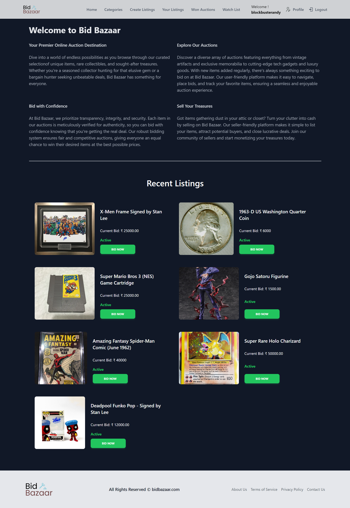
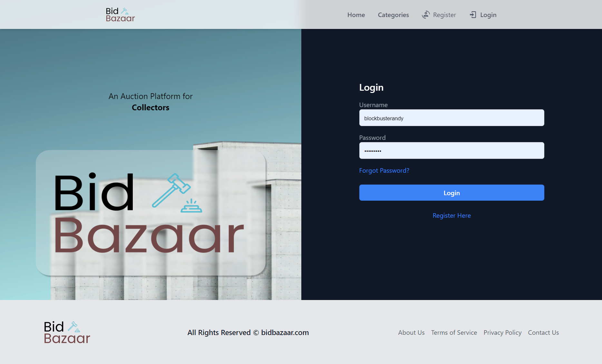
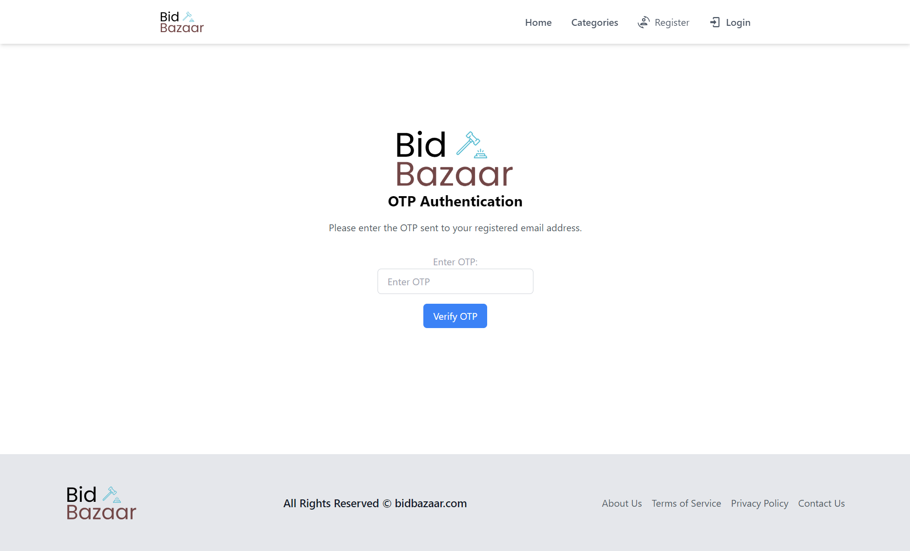
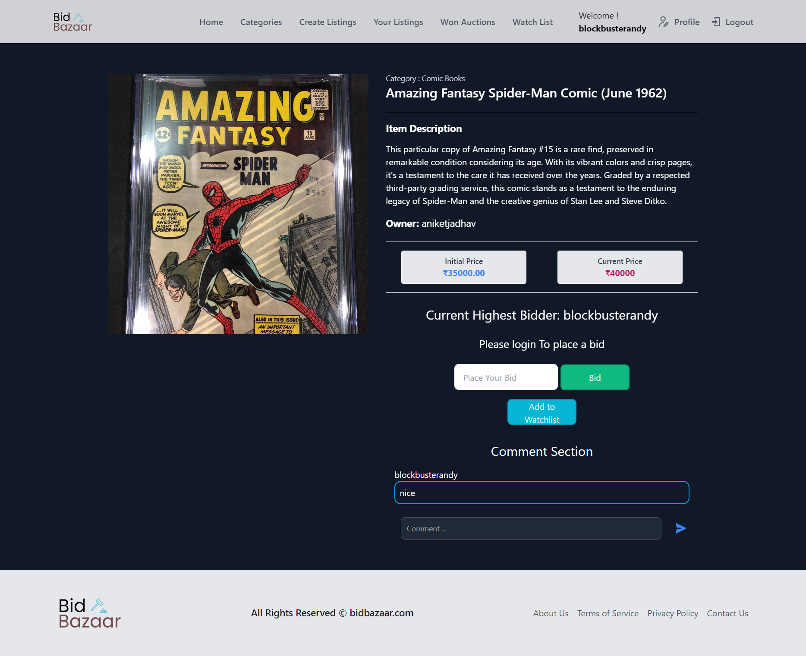
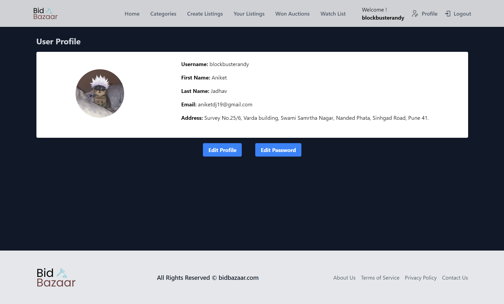
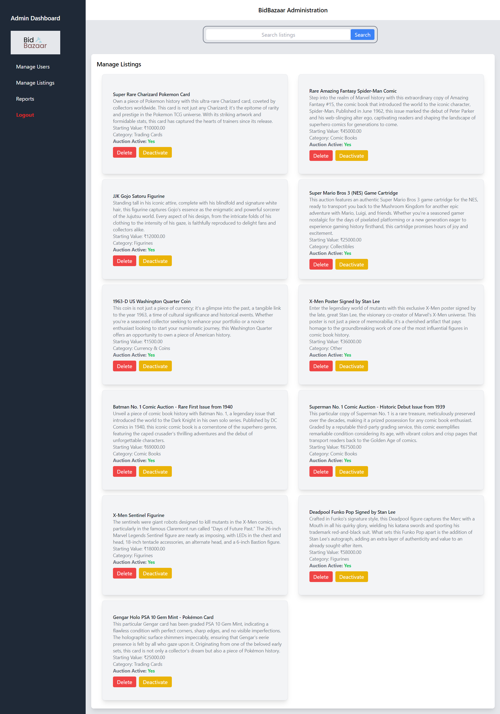
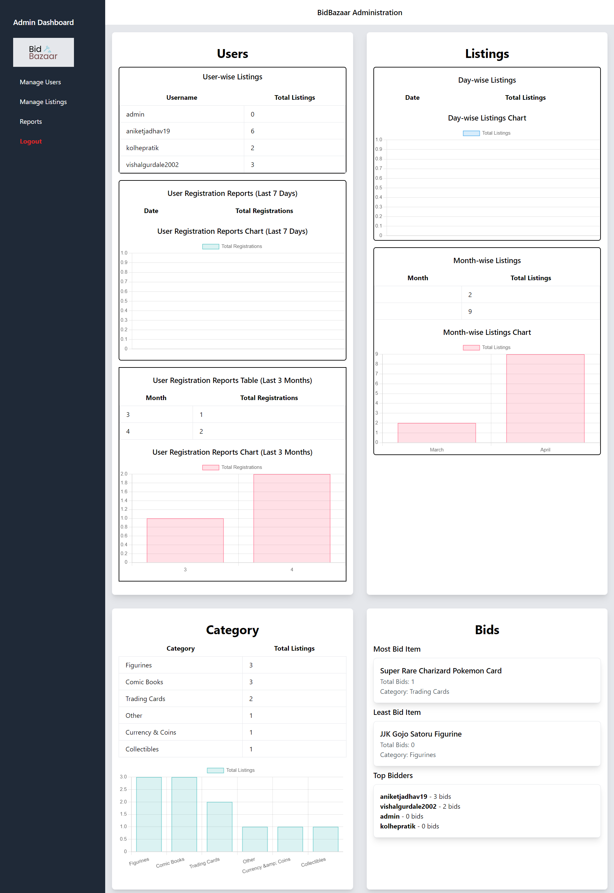

# Bid Bazaar

Welcome to Bid Bazaar, an innovative online auction platform that brings the excitement of traditional auctions to the digital world. Our platform modernizes the auction process, offering a user-friendly, secure environment for buyers and sellers to engage in real-time bidding.

## Features

- **User Authentication**: Secure sign-up, login, and password management.
- **Product Listing**: Easy-to-use tools for sellers to create detailed and attractive product listings with high-quality images and descriptions.
- **Product Management**: Dashboard for sellers to manage their listings, track bids, and view sale history.
- **Real-time Bidding**: Dynamic real-time bidding system with instant updates on bid status and auction progress.
- **Custom Admin Dashboard**: Custom Admin Dashboard to manage the platform and view reports.

## Technologies Used

- **Backend**: Django (Python web framework)
- **Database**: SQLite (default database for Django)
- **Frontend**: HTML, JavaScript, Tailwind CSS, Chart.js for reports
- **Development Tools**: Visual Studio Code

## Installation

1. Clone the repository:
    ```
    git clone https://github.com/BlockbusterAndy/BidBazaar.git
    ```
2. Install the required dependencies:
    ```
    pip install -r requirements.txt
    ```
3. Apply database migrations:
    ```
    python manage.py migrate
    ```
4. Go to Commerce\settings.py and change email settings ( if using G-Mail setup app specific password ):
    ```
    #Change with your own email and password
    EMAIL_HOST_USER = 'youremail'
    EMAIL_HOST_PASSWORD = 'yourpassword'
    ```
    If using the default email provided please check the spam mails in your email inbox.
5. Start the development server:
    ```
    python manage.py runserver
    ```

## Output Screens

 1. Home Page
 
 2. Login Page
 
 3. OTP Authentication
 
 4. Listing
 
 5. User Profile
 

## Admin Dashboard

1. Manage Listings

2. Reports


### Admin Credentials 
username - admin, password - admin

## Future Enhancements

While Bid Bazaar offers a robust auction platform with a range of features, there are several areas where we plan to implement enhancements in the future to further improve the user experience and expand the functionality. Some of the planned enhancements include:

### 1. Search and Filtering Options
   - **Objective**: add the search functionality to allow users to filter listings based on various criteria such as price range, category, location, and auction end time.
   - **Benefits**: Improved discoverability of listings, making it easier for users to find relevant products of interest.

### 2. Auction Notifications and Alerts
   - **Objective**: Implement real-time notifications and alerts for users to stay updated on bidding activity, outbid notices, auction ending reminders, and other relevant events.
   - **Benefits**: Enhanced user engagement, encouraging active participation in auctions, and reducing the likelihood of missing out on preferred listings.

### 3. Integration with Payment Gateways
   - **Objective**: Integrate popular payment gateways to facilitate secure and convenient payment processing for successful auction winners.
   - **Benefits**: Streamlined payment workflows, increased trust and confidence among users, and broader support for various payment methods.

### 4. Enhanced Analytics and Reporting
   - **Objective**: Enhance the admin dashboard with advanced analytics and reporting tools to provide insights into bidding trends, user behavior, and listing performance.
   - **Benefits**: Informed decision-making for sellers, actionable insights for platform optimization, and improved overall performance and competitiveness.

These future enhancements align with our commitment to continuously improving Bid Bazaar and delivering a best-in-class auction experience for our users. Stay tuned for updates as we work on implementing these exciting new features!


## Contributing

We welcome contributions to Bid Bazaar! To contribute, follow these steps:

1. Fork the repository.
2. Create a new branch for your feature or bug fix.
3. Commit your changes and push to the branch.
4. Submit a pull request.

## License

This project is licensed under the [MIT License](LICENSE).

## Acknowledgments

- Django Project for the excellent documentation and resources.
- Tailwind CSS for providing a powerful and flexible CSS framework.
- All the open-source libraries and tools used in this project.
